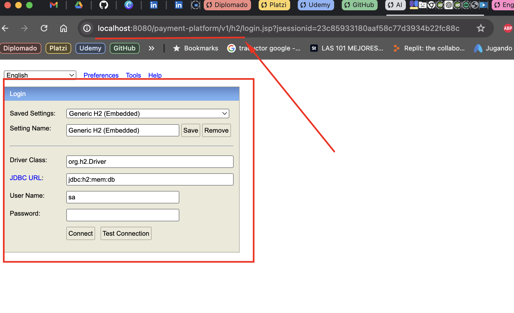

# Payment Platform

This project is a payment platform for processing purchases with credit cards.
### Features.

- `url LOCAL`: http://localhost:8080/payment-platform/v1
- `url AWS`: http://52.87.241.152:8080/payment-platform/v1
- `DB`: H2, base de datos volátil.
- `Url DB local`: http://localhost:8080/payment-platform/v1/h2/
- `Url DB AWS`: http://52.87.241.152:8080/payment-platform/v1/h2/
- `Context`: payment-platform
- `Code building tool`: Gradle
- `Framework`: Spring boot 3.3.1
- `Language`: Java 17
- `URL swagger LOCAL`: http://localhost:8080/payment-platform/v1/swagger-ui/index.html
- `URL swagger AWS`: http://52.87.241.152:8080/payment-platform/v1/swagger-ui/index.html
  

# Available methods.

### - Processing Payment:

LOCAL:
- `POST`: http://localhost:8080/payment-platform/v1/payments

AWS:
- `POST`: http://52.87.241.152:8080/payment-platform/v1/payments


Request:

```json
{
   "amount": 300,
   "currency": "COP",
   "installments_count": "12",
   "description": "Payment for services rendered",
   "customer_dto": {
      "first_name": "Angie",
      "last_name": "Rodriguez Suarez",
      "identification_type": "CC",
      "identification": "1234",
      "email": "angie.rodriguez@example.com",
      "address":""
   },
   "card_dto": {
      "card_number": "4111111111111111",
      "card_type": "CREDIT",
      "expiration_date": "12/25",
      "cvv": "123",
      "card_holder": "Angie Rodriguez S."
   }
}
```

Response success: Http-Code: 200

```json
{
   "id": "2",
   "amount": 300,
   "currency": "COP",
   "status": "APPROVED",
   "created_at": "2024-07-16T16:53:21.128565",
   "description": "Payment for services rendered"
}
```

### - Refound Payment:

LOCAL:
- `POST`: http://localhost:8080/payment-platform/v1/payments/:paymentId
  
AWS:
- `Refound Payment: POST`: http://52.87.241.152:8080/payment-platform/v1/payments/:paymentId

Request: N/A

Response success: Http-Code: 200

```json
{
   "id": "1",
   "amount": 300.00,
   "currency": "COP",
   "status": "REFUNDED",
   "created_at": "2024-07-16T18:23:24.533563",
   "description": "Payment for services rendered"
}
```


# ¿How to run the program?

### STEPS IN CLOUD COMPUTING
- From postman consume the following REST services:

LOCAL:
- `POST`: http://localhost:8080/payment-platform/v1/payments
- `POST`: http://localhost:8080/payment-platform/v1/payments/:paymentId

AWS:
- `POST`: http://52.87.241.152:8080/payment-platform/v1/payments
- `POST`: http://52.87.241.152:8080/payment-platform/v1/payments/:paymentId

The collection is located in the following project path:

```
./src/main/resources/collections/Payment-Platform.postman_collection.json
```

### STEPS IN DOCKER:

1. The application is deployed on Docker, Docker must be installed on the local machine and the
   following commands should be executed to create the image and deploy it on the container:

    - docker build -t payment-platform .
    - docker run -d -p 8080:8080 payment-platform

2. The Postman collection is attached to all endpoints in the mail so it can be downloaded and used
   to make the corresponding requests.
3. There is no database script generated since, for the purposes of the technical test, a volatile
   H2 Database Engine was used, and the database is created with its respective tables in memory
   while the application is deployed. To access the H2 DB, once the application is deployed, you
   must go to the following route: 
   - http://localhost:8080/payment-platform/v1/h2/

### STEPS IN LOCAL:

- Clone the project from the following path using the 'git
  clone: https://github.com/angiekroll/payment-platform.git
- Import the project from your IDE in this case intellij
- Compile the project
- Run
- Tester Potsman


# ¿How to connect to the DB?

- `JDBC`: jdbc:h2:mem:db
- `User Name`: sa
- `Password`:



